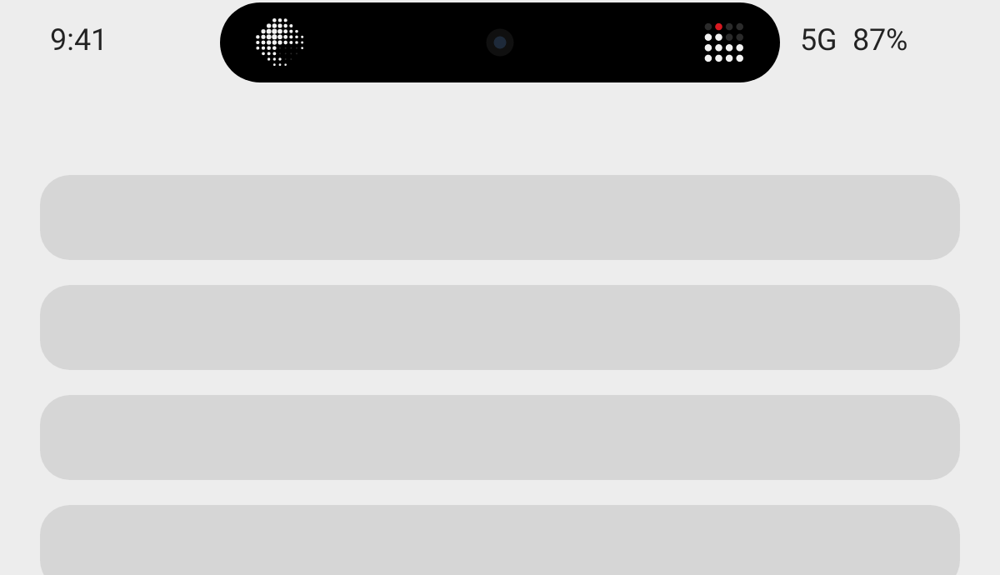
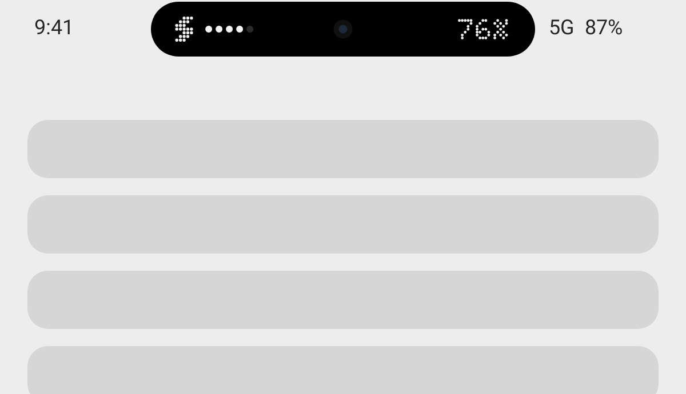
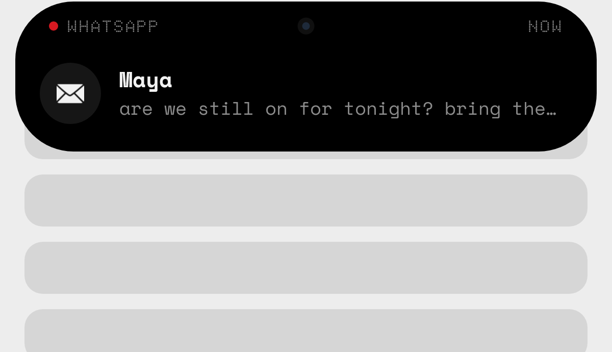
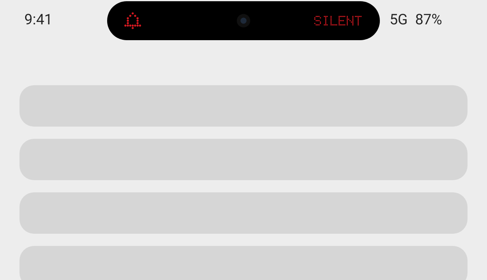
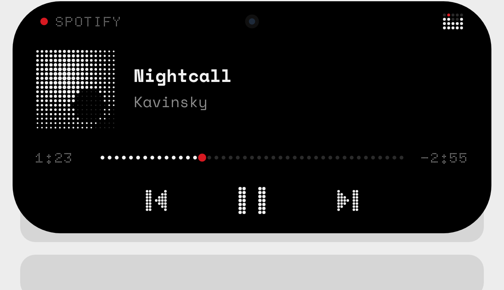


# Wallisland

A Dynamic Island for Android, in the spirit of MT Capsule and Apple's island, drawn in the Nothing
design language: black, white, one red, and dots everywhere.

| | |
|---|---|
|  |  |
|  |  |





## What it does

- **Now playing.** Halftone dot album art and a dot equaliser on either side of the camera. Tap to
  expand into full controls: a dotted progress bar you can tap to seek, and dot-matrix
  prev / play / next buttons.
- **Notifications.** Only alerts that would make a sound open the island. Chats show the latest
  message. Tap to open the notification, or swipe up to dismiss it.
- **Charging and low battery.** A five-dot gauge and the percentage in Doto. It turns red at 20%.
- **Ring / vibrate / silent.** A short confirmation whenever the ringer mode changes.
- **Gestures.** Tap to expand or open, swipe up to dismiss, swipe down to expand, long-press the
  empty pill to open settings. Tapping outside an expanded island collapses it.
- **Motion.** Spring-driven morphing between shapes, a press-to-squish response, and cross-faded
  content.

## Built to stay on

- A foreground service with `START_STICKY`, restarted after swiping from recents, reboots and app
  updates.
- The notification listener is kept bound by the system, starts the overlay whenever it connects, and
  asks to be rebound if an OEM skin drops it.
- A one-tap request for unrestricted battery use in settings.
- A Quick Settings tile to switch it on and off.
- It hides for full-screen video and games, and in landscape. Both can be turned off.
- It centres on the front-camera cut-out automatically, and you can fine-tune the size and position
  with live preview.

## Install

Download the APK from the latest **Build APK** run under *Actions* (artifact `wallisland-apk`), or
build it yourself:

```sh
./gradlew assembleRelease   # app/build/outputs/apk/release/app-release.apk
```

Then open the app and allow the permissions it asks for:

1. **Draw over apps** (required).
2. **Notification access**, for notifications and now playing. On Android 13+ this may be greyed out
   for sideloaded apps. To enable it, go to *Settings → Apps → Wallisland → ⋮ → Allow restricted
   settings*, then try again.
3. **Unrestricted battery**, so the system doesn't kill the island.

Use the **Try it** buttons in the app to preview each state.

Requires Android 8.0 (API 26) or newer.

## Fonts

[Doto](https://fonts.google.com/specimen/Doto) (dot-matrix) and
[Space Mono](https://fonts.google.com/specimen/Space+Mono), both under the SIL Open Font License
(see `licenses/`). Wallisland is not affiliated with Nothing Technology.
