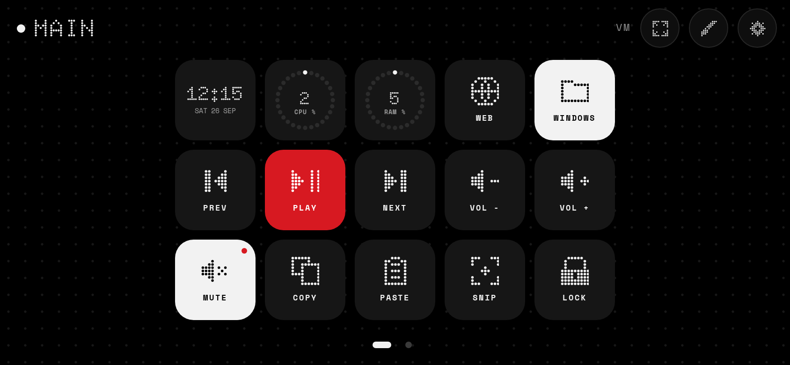

# Wallisland

A Dynamic Island for Android, in the spirit of MT Capsule and Apple's island, drawn in the Nothing
design language: black, white, one red, and dots everywhere.

| | |
|---|---|
|  |  |
|  |  |
|  |  |
|  |  |
|  |  |

|  |  |
|---|---|


## What it does

- **Now playing.** Halftone dot album art and a dot equaliser on either side of the camera while music
  plays; it disappears 5 seconds after you pause. Tap to
  expand into the full player:
  - Drag along the dotted progress bar to scrub, or tap to jump.
  - Back 10 s, previous, play / pause, next and forward 10 s, all as dot-matrix buttons.
  - Tap the album art to switch between the real cover and the dot-matrix version.
  - **Colour dots** (on by default): the dot art is a colour halftone of the cover, and the equaliser
    and progress bar take the cover's strongest colour. Turn it off for classic white dots.
  - Tap the song title to open the music app.
- **Notifications.** Only alerts that would make a sound open the island. Chats show the latest
  message. Tap to open the notification, or swipe up to dismiss it.
- **Calls.** During a phone, WhatsApp, Instagram or other call, the island shows a breathing red
  dot and a live call timer. Tap it to return to the call, or swipe up to hide it.
- **Live activities.** Clock-app timers and stopwatches count down beside the camera; Google Maps (and
  other navigation apps) show the next turn and distance; downloads, uploads and updates show a
  filling ring of dots with the percentage.
- **Unlock.** A dot padlock opens and a tick lands when you unlock the phone.
- **Earbuds.** When Bluetooth headphones connect, the island shows their battery (needs the optional
  Nearby devices permission).
- **Quick toggles.** Long-press the island for torch, ring / vibrate / silent, rotation lock and
  settings.
- **Per-app control.** *Apps that can pop up* lets you turn island notifications off app by app.
- **Accent colour.** Swap the Nothing red for orange, yellow, green, blue, purple, pink or white.
- **Charging and low battery.** A five-dot gauge and the percentage in Doto. It turns red at 20%.
- **Ring / vibrate / silent.** A short confirmation whenever the ringer mode changes.
- **Gestures.** Tap to expand or open, swipe up to dismiss, swipe down to expand, swipe music left or
  right to skip, long-press for quick toggles. Tapping outside an expanded island collapses it.
- **Motion.** Spring-driven morphing between shapes, a press-to-squish response, and cross-faded
  content.

## Built to stay on

- A foreground service with `START_STICKY`, restarted after swiping from recents, reboots and app
  updates.
- The notification listener is kept bound by the system, starts the overlay whenever it connects, and
  asks to be rebound if an OEM skin drops it.
- A one-tap request for unrestricted battery use in settings.
- A Quick Settings tile to switch it on and off.
- It hides for full-screen video and games, in landscape, and while the camera or a voice recorder
  is in use (but stays during video and voice calls). Each can be turned off.
- **Opacity** slider (85% by default): the island is slightly see-through, with a near-solid top strip
  so status-bar icons never show through behind it.
- It centres on the front-camera cut-out automatically. Settings shows exactly where it found the
  camera, and **Fit to camera** sizes the pill around it. You can fine-tune everything with live
  preview.

## Install

On your phone, download
**[Wallisland.apk](https://github.com/FRENCHIIIFRIES/wallisland/releases/latest/download/Wallisland.apk)**
(always the newest build) and open it to install. Or build it yourself:

```sh
./gradlew assembleRelease   # app/build/outputs/apk/release/app-release.apk
```

Then open the app and allow the permissions it asks for:

1. **Show above status bar** (recommended). Tap Allow, then turn on *Wallisland* in Accessibility.
   Accessibility overlays are the only windows Android lets an app place above the status bar
   icons. The service reads nothing on screen. Without it, the island still works
   but the status-bar icons sit on top of it.
2. **Draw over apps**, needed if you don't use the option above.
3. **Notification access**, for notifications and now playing. On Android 13+ this (and the Accessibility
   switch) may be greyed out for sideloaded apps. To enable it, go to *Settings → Apps → Wallisland → ⋮ → Allow restricted
   settings*, then try again.
4. **Unrestricted battery**, so the system doesn't kill the island.

Use the **Try it** buttons in the app to preview each state.

### Updating

Open Wallisland and scroll to **Updates**. It checks this repo's latest release when the app opens;
tap **Update** to download and install it in place. (The first time, Android asks you to allow
Wallisland to install apps.) Every build from build 13 on is signed with the same key, so updates
install over each other. If you're coming from build 12 or older, uninstall once and install fresh.

Requires Android 8.0 (API 26) or newer.

## Also here: Dotdeck

[**Dotdeck**](deck/) turns your phone into a macro deck for your computer, like Touch Portal or Macro
Deck, in the same dot style: hotkeys, media keys, apps, websites, commands, folders, and live clock /
CPU / RAM tiles. Run it on the computer, scan the QR code, done. It has its own downloads under
Releases (**Dotdeck build …**).



## Fonts

[Doto](https://fonts.google.com/specimen/Doto) (dot-matrix) and
[Space Mono](https://fonts.google.com/specimen/Space+Mono), both under the SIL Open Font License
(see `licenses/`). Wallisland is not affiliated with Nothing Technology.
