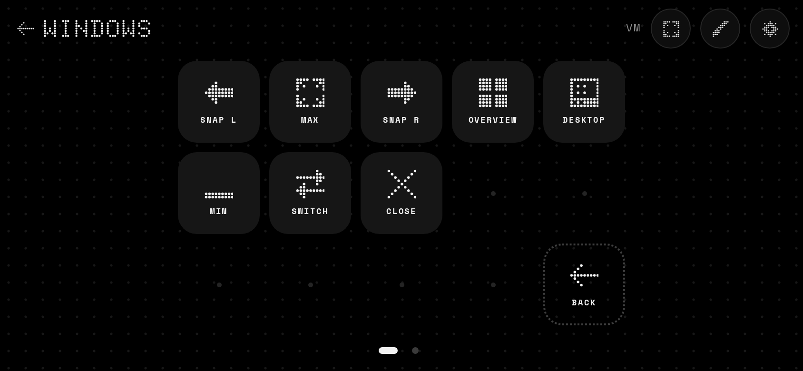
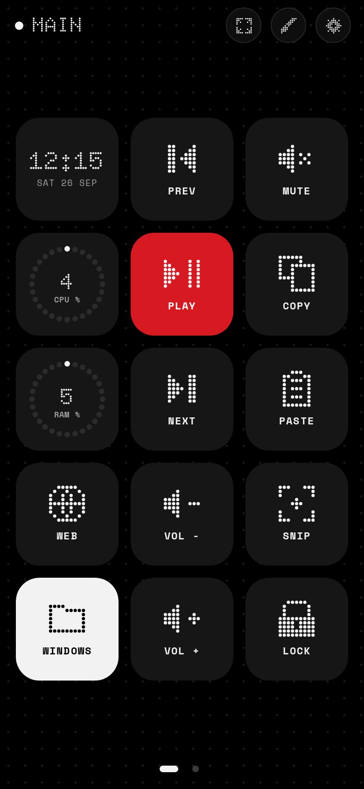
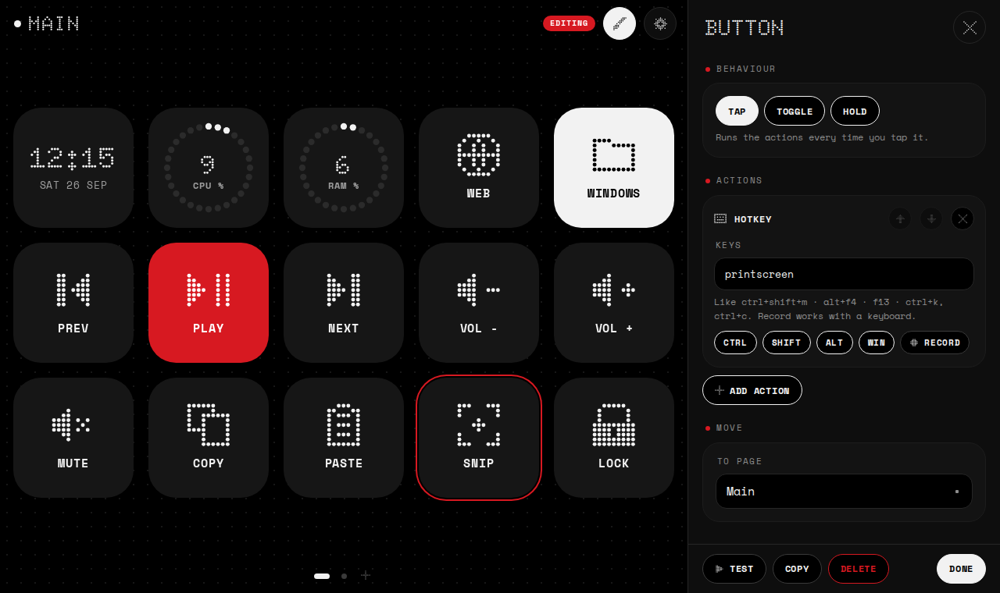

# Dotdeck

A macro deck in the spirit of Touch Portal and Macro Deck, drawn in the same Nothing-style dot language
as Wallisland: black, white, one accent, and dots everywhere. Run it on your computer, scan the QR code
with your phone or tablet, and that screen becomes a grid of buttons for your PC.


|  |  |
|---|---|



## What it does

- **Buttons that do things on your computer.** Each button runs a list of actions in order:
  - **Hotkey:** any combo, like `ctrl+shift+m`, `alt+f4`, `f13`, or a chord like `ctrl+k, ctrl+c`.
    Type it, tap the Ctrl / Shift / Alt / Win chips, or press **Record** and hit the keys.
  - **Type text:** types a snippet as if from a keyboard.
  - **Media key:** play / pause, next, previous, stop, volume up / down, mute.
  - **Open app / file:** an app, a file or a folder, with optional arguments.
  - **Website:** any address, plus app links like `spotify:` or `steam://`.
  - **Command:** a shell command, run in the background (cmd on Windows, sh on Mac and Linux).
  - **Wait:** a pause between actions.
  - **Go to page** and **Back:** open a folder of more buttons, and come back.
- **Tap, toggle or hold.** Toggle buttons light up white with an accent dot while they're on and run a
  separate list when turned off. Hold buttons repeat while your finger stays down, handy for volume.
- **Live tiles.** A dot-matrix clock, and CPU and RAM rings that fill up dot by dot (the dots turn to
  the accent colour above 85%). Any label can include live values: `{cpu}`, `{ram}`, `{ram_used}`,
  `{time}`, `{day}`, `{date}`, `{month}`, `{host}`.
- **Your own look.** 80+ dot icons, or your own picture (optionally redrawn as colour dots, like
  Wallisland's album art). Dark, light, accent or outline tiles. Eight accent colours.
- **Pages and folders.** Swipe or tap the page dots to switch pages; folders stay out of the dots and get
  a back arrow.
- **Edit from anywhere.** The pencil turns on edit mode on any paired screen, the phone or the
  computer's browser. Tap a button to edit it, tap an empty spot to add one, drag to move or swap.
  Every screen updates as you go.
- **Made for a phone on a stand.** Big square buttons that fill the screen, a grid that turns sideways
  when a phone is upright, haptics on Android, fullscreen, and it reconnects on its own after Wi-Fi
  blips.

## How the phone talks to the computer

Over your own Wi-Fi, directly. Dotdeck on the computer serves the deck to the phone's browser and keeps a
WebSocket open to it, so a press reaches the computer in a few milliseconds. There's no account, no cloud
and no internet needed. The QR code carries a random pairing key; without it a device can't connect.

## Get started

1. Download Dotdeck for your computer from this repo's
   [Releases](https://github.com/FRENCHIIIFRIES/wallisland/releases) (the newest **Dotdeck build**):
   - **Windows:** `Dotdeck-windows.exe`
   - **Mac:** `Dotdeck-macos.zip`
   - **Linux:** `Dotdeck-linux`
2. Run it. It sits in the system tray (menu bar on a Mac) and opens its page in your browser with a QR
   code.
3. Scan the QR code with your phone's camera. The phone must be on the same Wi-Fi as the computer.
4. Optional: *Add to Home screen* from the browser menu, so the deck opens full screen like an app.

Opening Dotdeck again just brings its page back up; the tray menu has **Open Dotdeck** and **Quit**.

### First-run notes

- **Windows:** SmartScreen may say it doesn't recognise the app (it isn't code-signed): *More info →
  Run anyway*. When Windows Firewall asks, allow Dotdeck on **private** networks, or the phone can't
  reach it.
- **Mac:** unzip it, then right-click **Dotdeck → Open** the first time (it isn't notarised). To send
  keys, allow it in *System Settings → Privacy & Security → Accessibility*. Dotdeck tells you on the
  phone if that permission is missing.
- **Linux:** `chmod +x Dotdeck-linux && ./Dotdeck-linux`. It prints the QR code in the terminal and
  stops with Ctrl+C. Keys are sent through X11, so on a Wayland desktop they only reach X11 (XWayland)
  apps.
- **Phone won't connect?** Check it's on the same Wi-Fi (not guest Wi-Fi or mobile data), and try the
  other addresses listed under the QR code if your computer has more than one network.
- **Keep the screen on:** set your phone's screen timeout to something long, or use a stand that
  charges it.

## Settings

Tap the gear. From there you can show the pairing QR code again, change the grid (1 to 10 columns, 1 to
8 rows), pick the accent colour and 12 / 24-hour clock, turn haptics and the portrait grid on or off for
that device, **Export** and **Import** the whole deck as a file, and **Unpair every device**, which makes
a new QR code so anything paired before has to scan again.

## Security

Anyone who has the pairing key can press buttons, and buttons can run commands. So only pair your own
devices, and use **Unpair every device** if a key gets out. Traffic stays on your local network but
isn't encrypted, as with Touch Portal and Macro Deck.

## Build it yourself

You need [Rust](https://rustup.rs).

```sh
cd deck
cargo run                  # debug build; serves the web app straight from web/
cargo build --release      # target/release/dotdeck(.exe), with the web app built in
cargo test
```

Options: `--port <n>` (default 8420), `--config <dir>`, `--no-open` (don't open the browser).

The deck, pairing key and port live in `config.json` (the previous version is kept as
`config.backup.json`) in:

- Windows: `%APPDATA%\Dotdeck`
- Mac: `~/Library/Application Support/Dotdeck`
- Linux: `~/.config/Dotdeck`

### What's where

- `src/`: the computer side, in Rust. `server.rs` (HTTP and WebSocket, pairing), `app.rs` (shared
  state, presses, toggles), `actions.rs` (keys, text, apps, commands), `keys.rs` (hotkey names),
  `stats.rs` (CPU and RAM), `config.rs` (the saved deck and the starter deck), `qr.rs` (the dot QR
  code), `tray.rs` (tray icon on Windows and Mac).
- `web/`: the deck app the phone opens. Plain JavaScript modules, no build step: `app.js` (connection,
  grid, pages, pressing), `editor.js`, `settings.js`, `tiles.js` (drawing buttons and widgets),
  `icons.js` (the dot icons).
- `packaging/`: the Mac app bundle. `.github/workflows/deck.yml` builds all three and publishes a
  release (never marked "latest", so Wallisland's in-app updater keeps finding its APK).

## Fonts

[Doto](https://fonts.google.com/specimen/Doto) and [Space Mono](https://fonts.google.com/specimen/Space+Mono),
under the SIL Open Font License (see `../licenses/`). Dotdeck is not affiliated with Nothing Technology,
Touch Portal or Macro Deck.
